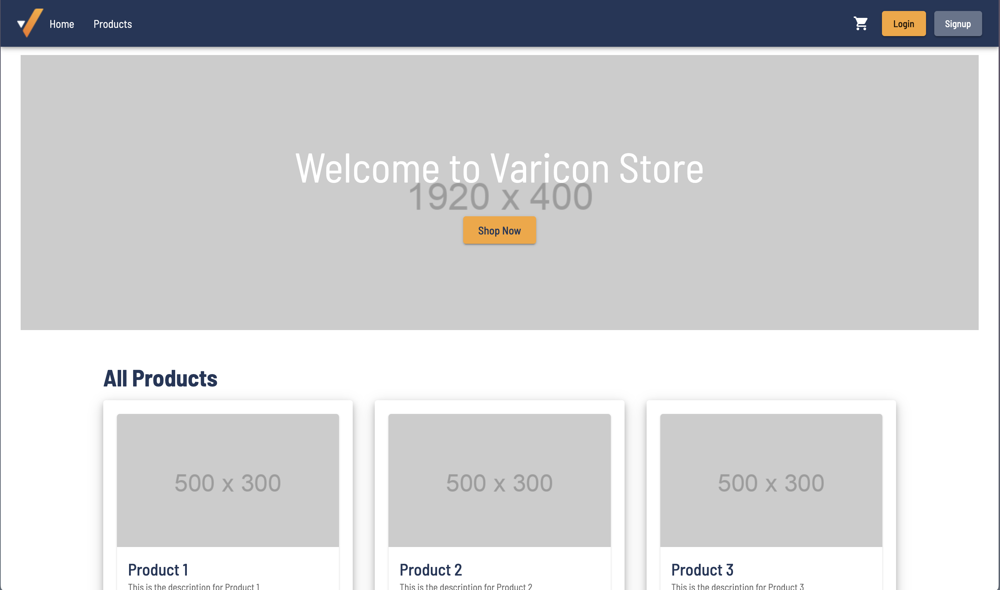
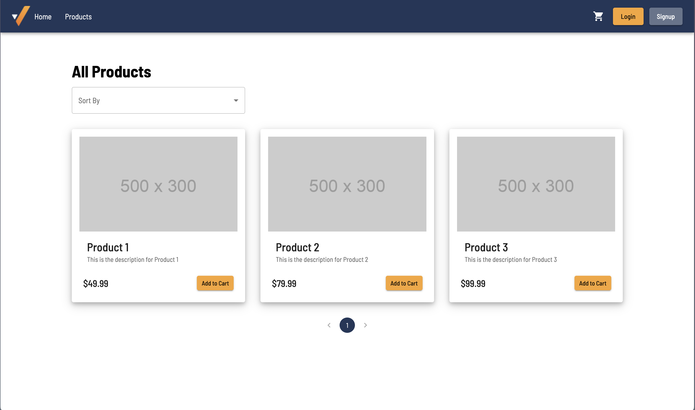
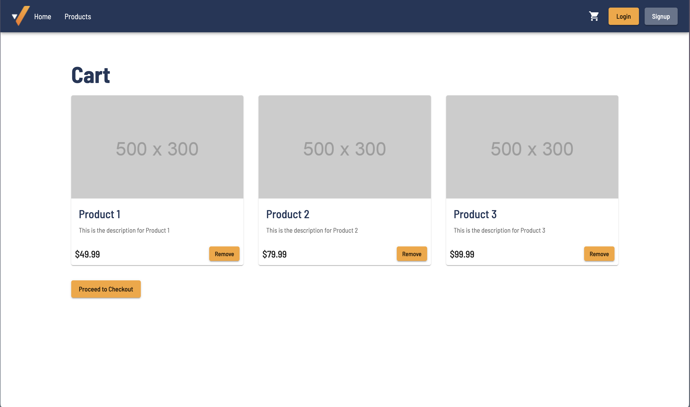
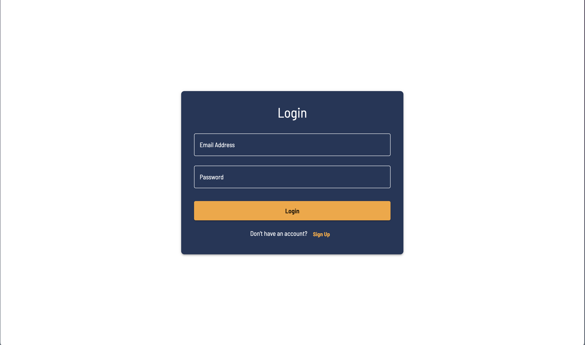
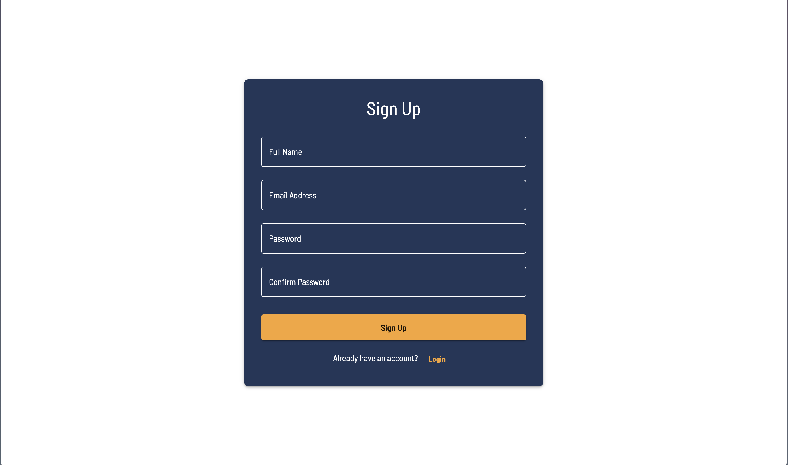

### How to install?

- Clone the repo: `git clone https://github.com/adars-kafle/ecomm-practice.git`

- Change directory: `cd ecomm-practice`

- Install the libraries: `npm install`

- Run the project: `npm run dev`

### Screenshots

- **Home Page**:
  

- **Products Page**:
  

- **Cart Page**:
  

- **Login Page**:
  

- **Signup Page**:
  
